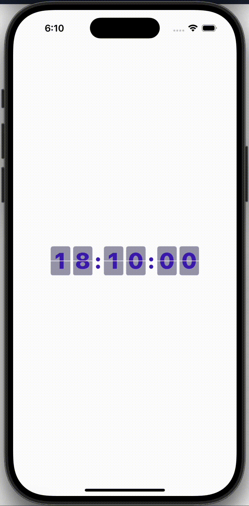

# FlipClock

FlipClock is a visually appealing and functional clock application implemented using SwiftUI. It features animated flip clock digits to display the current time in an engaging and modern way.

## Screenshots



## Table of Contents

- [Features](#features)
- [Project Structure](#project-structure)
- [Installation](#installation)
- [Usage](#usage)
- [Acknowledgments](#acknowledgments)

## Features

- Smooth flipping animation for time changes.
- Modular architecture for flexibility and scalability.
- Fully implemented using SwiftUI for declarative UI development.
- Customizable appearance for individual flip views.

## Project Structure

The project consists of the following main components:

### 1. **ClockView**
- Displays the complete clock interface with hours, minutes, and seconds.
- Combines multiple `FlipView` components with separators (`:`).

### 2. **FlipViewModel**
- Manages the time state and triggers updates for `FlipView` components.
- Implements a timer to update time every second.

### 3. **FlipView**
- A single digit display with animated top and bottom halves.
- Uses `SingleFlipView` for each half.

### 4. **SingleFlipView**
- Renders individual halves of a flip digit.
- Provides alignment and padding configurations for top and bottom segments.

## Installation

To set up the FlipClock project locally:

1. Clone the repository:
   ```bash
   git clone https://github.com/mohitDhami87/FlipClock.git
   ```
2. Open the project in Xcode:
   ```bash
   cd FlipClock
   open FlipClock.xcodeproj
   ```
3. Build and run the project on a simulator or a physical device.

## Usage

1. Launch the app to view the clock interface.
2. Observe the smooth flip animations as the time changes every second.

### Customization

To customize the appearance or behavior:
- Modify the `FlipViewModel` for animation timing or time formatting.
- Adjust the `SingleFlipView` for padding, font size, or alignment.

## Acknowledgments

This project was inspired by traditional flip clocks and aims to bring the nostalgic charm of flip digits into a modern app. Special thanks to the SwiftUI framework for simplifying declarative UI development.


